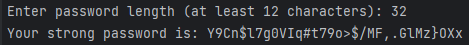

# Password Generator
> This simple Python program helps generate **very strong** passwords. 
> If you don't have any ideas for your passwords, this program will be great.


## Table of Contents
* [General Info](#general-information)
* [Technologies Used](#technologies-used)
* [Features](#features)
* [Screenshots](#screenshots)
* [Setup](#setup)
* [Usage](#usage)
* [Acknowledgements](#acknowledgements)


## General Information
The purpose of the program is to generate cryptographically strong random password. 
Thanks to this project, I learned how to use Python's modules like _string_ and _secrets_ with 
_try-except_ block and _while_ loop.

> **Remember that** _secrets_ module should be used in preference to the default pseudo-random number 
> generator in the random module, which is designed for modelling and simulation, 
> not security or cryptography.


## Technologies Used
- [Python](https://www.python.org/) - version 3.11.3
- from Python's standard library:
  - [_secrets_](https://docs.python.org/3/library/secrets.html) module
  - [_string_](https://docs.python.org/3/library/string.html) module


## Features
- The user enters only the number of characters needed to generate the password.
- Generated password contains **at least 12 characters**:
  - letters (minimum 3 upper- and minimum 3 lowercase),
  - minimum 3 digits and
  - minimum 1 special character.


## Screenshots



## Setup
I assume You know how to cloning this repository. If not, I refer you to 
[this publication](https://docs.github.com/en/repositories/creating-and-managing-repositories/cloning-a-repository).

Python version should not matter here, although the program was written and tested on version 3.11.3. 
There is no need to install anything extra.

> If You don't have any Python version, download and install [from here](https://www.python.org/).

You can check your Python version by typing in terminal:
```bash
$ python --version
```

## Usage
How does one go about using it? It's simple. :-) Type in terminal:
```bash
$ python password-generator.py
```


## Acknowledgements
- This program was inspired by one of exercises of
[the Practical Python](https://praktycznypython.pl/) educational program.
- Many thanks to [Krzysztof Mędrela](https://medrela.com/).
